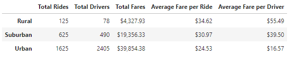
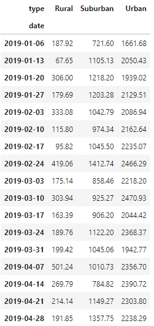
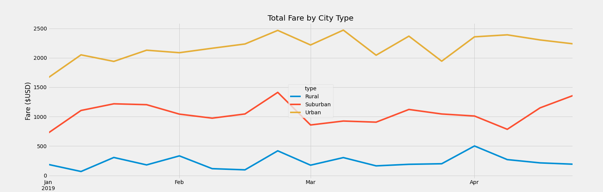

# PyBer_Analysis
[PyBer Challenge](./PyBer_Challenge.ipynb)

## Overview
PyBer is a python-based ride-sharing app company. Analyze large csv files and create visualizations to tell a compelling story about the data to improve access to ride-sharing services and determine affordability for underserved neighborhoods. In this analysis, create a summary DataFrame of the ride-sharing data by city type. Using Pandas and Matplotlib, create a multiple-line graph that shows the total weekly fares for each city type. Write a written report that summarizes the weekly fare data by city type.

## Results
### Totals by City Type

- Urban cities have the highest amount of total rides, total drivers, and total fares, but they have the lowest average fare per ride and average fare per driver.
- Rural cities have the lowest total rides, total drivers, and total fares, but they have the highest average fare per ride and average fare per driver. 
- Suburban cities' totals are all in the middle of rural and urban cities' totals.

### Total Fare per Week by City Type(January to April in 2019)

Urban total fares are the highest. Rural total fares are the lowest. Suburban total fares are in the middle. Urban, suburban, and rural total fares all peak during the week of February 24th, with suburban and rural total fares dipping a little before they peak, and only rural total fares peaking even higher later in the year during the week of April 7th.

- Urban total fares start at $1661.68 per week and slowing increases until February 24th and then goes up and down a bit before plateauing at the start of April.
- Suburban total fares fluctuate around $1000 per week throughout the timeframe, peaking during the week of February 24th and dipping at the beginning of April.
- Rural total fares fluctuate around $200 per week, peaking two times, once on the week of February 24th and once on the week of April 7th.

## Summary
Rural cities have the lowest total fares, but the highest average fare per ride, along with the highest average fare per driver due to the low amount of total drivers. My recommendations would be the following:
- Have more promotions or sales on getting rides in rural cities to encourage people in those cities to use the app more. 
- Creating and implementing incentives to become a driver for the app in order to increase the accessibility of rides in rural cities.
- Implementing a rating system and providing incentives for drivers who are rated more highly. 
- Send out a survey to drivers to gain an understanding of how they think it would be best to rate them and what incentives they would prefer. 

I would recommend a similar process being done for suburban areas to increase the number of drivers and rides, thus increasing the total fares. A similar process can be done for urban areas, but I would recommend an additional, more in-depth analysis be done on rides and drivers specifically to determine what would be the best course of action, due to them already having a large number of rides and drivers.

